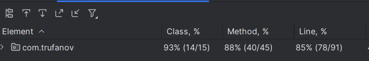

# Banking Backend API

A Spring Boot backend API for managing customers, accounts, and transactions, using in-memory H2 for local testing, with
support for other databases and caching.

## Helpful navigation around README.md
- [What was done](#what-was-done)
- [API usage](#api-usage)
- [Error Handling](#error-handling)
- [Database](#database)
- [Caching](#caching)
- [Testing](#testing)
- [How to launch](#how-to-launch)

## What was done:

Developed API supports:

- **Customer Management**: Create and retrieve customers;
- **Account Management**: Open accounts and manage balances;
- **Transactions**: Perform first accounts deposits. As an improvement (there was no such requirement in task) to add
  transfer between two payment accounts;
- **Caching**: Optimized caching for customer account balances (to prevent possible DoS attacks and to prevent constant
  balance recalculations if amount of transactions is large).

## API usage:

- **Create Customer**
    - **POST** `/api/customer/create`
    - **Request Body**:
      ```json
      {
        "name": "Mykyta",
        "surname": "Doe"
      }
      ```
    - **Response**:
      ```json
      {
        "id": 1
      }
      ```

- **Get Customer Information**
    - **GET** `/api/customer/{customerId}/info`
    - **Response**:
      ```json
      {
        "customerId": 1,
        "name": "Mykyta",
        "surname": "Trufanov",
        "accounts": [
          {
            "accountId": 1,
            "balance": 500
          },
          {
            "accountId": 2,
            "balance": 0
          }
        ],
        "balance": 500
      }
      ```

### Account Endpoints

- **Create Account**
    - **POST** `/api/account/create`
    - **Request Body**:
      ```json
      {
        "customerId": 1,
        "initialCredit": 500
      }
      ```
    - **Response**:
      ```json
      {
        "id": 100
      }
      ```

## Error Handling:

- **General Exception**:
  ```json
  {
    "error": "Exception",
    "message": "An error occurred"
  }
- **[EntityNotFoundException.java](src%2Fmain%2Fjava%2Fcom%2Ftrufanov%2Fexception%2FEntityNotFoundException.java)**:
  ```json
  {
    "message": "Entity not found"
  }

## Database:

The API uses **H2 in-memory database** for quick setup and testing, configurable to support external databases (e.g.,
PostgreSQL or MySQL) through spring configuration file [application.properties](src%2Fmain%2Fresources%2Fapplication.properties).

## Caching:

Guava Cache is used for efficient balance calculations:

- **Account Balance Cache**: Caches individual account balances, refreshed every 10 minutes or on transaction updates.
- __Possible improvement__: add caching on customer entries retrieval from DB, so no more unnecessary calls to DB would be made.

## Testing:

The project includes **unit and integration tests** to verify business logic and data consistency, covering:

- Customer, account, and transaction creation
- Cache behavior and balance consistency

Test coverage is next (not all lines covered due to Lombok auto-generated methods):


## How to launch?

1. **Clone and Run**:
   ```bash
   git clone git@github.com:daidyaka/banking-backend-api-task.git
   cd banking-backend-api
   mvn spring-boot:run

or just start [BankingBackendApiApplication.java](src%2Fmain%2Fjava%2Fcom%2Ftrufanov%2FBankingBackendApiApplication.java) from your IDEA

2. **Access H2 Console**: Go to `http://localhost:8080/h2-console` and use `jdbc:h2:mem:banking-api` as the JDBC URL.

